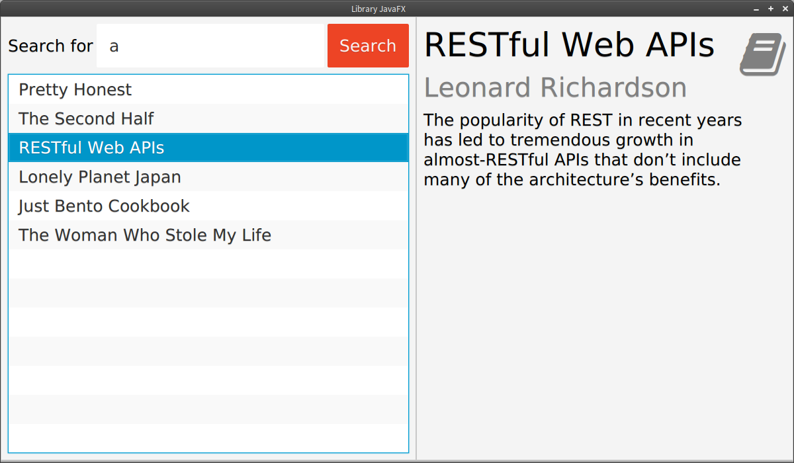

# MvvmFX Books Example

This example app is a client for a library REST service. You can search for books and view the
details of found books in a master-detail view.

This example was used for [a talk](http://www.jug-gr.de/2014/12/03/model-view-star.html) at the
[JavaUserGroup Görlitz](http://www.jug-gr.de) on [UI-Design patterns](https://github.com/lestard/model-view-star).

Originally [this app](https://github.com/sbley/hypermedia-library-client/tree/javafx) was created by [Stefan Bley](https://github.com/sbley) and
[Alexander Casall](https://github.com/sialcasa) for a talk on Hypermedia-APIs.

### Run the example with a REST backend

By default the example app uses the REST-Backend from Stefan Bley as he used it for his talk. 
To setup the app with the REST-Backend follow these steps:
- git clone the hypermedia server from [https://github.com/sbley/hypermedia-library-server](https://github.com/sbley/hypermedia-library-server)
- open up a command line and change into the cloned directory
- run `mvn clean install` to build the hypermedia server
- run `mvn wildfly:run`. This will download the server runtime and startup the server automatically.

After a few seconds you will see a message like "... Deployed "ear-0.0.1-SNAPSHOT.ear" ...". This means everything is ok and the server is running.
Now you can start the client app `de.saxsys.mvvmfx.examples.books.App` and play around with the example.

### Run the example with a inmemory mock backend

For people who don't like to download and setup the REST backend we have created a mock backend service that can be used instead.
The only thing to do is to change a flag [ENABLE_MOCK_SERVICE](/examples/mvvmfx-books-example/src/main/java/de/saxsys/mvvmfx/examples/books/App.java#L21) in the class `de.saxsys.mvvmfx.examples.books.App` to `true`.
This way the mock service will be used instead of the REST service.

## Used third party libraries
The app uses the following libraries (among others):

- [FontAwesomeFX](https://bitbucket.org/Jerady/fontawesomefx) // Icons
- [FlatterFX](http://www.guigarage.com/javafx-themes/flatter/) // Styling
- [Advanced-Bindings](https://github.com/lestard/advanced-bindings) // Binding-Utils
- [EasyDI](https://github.com/lestard/EasyDI)  // Dependency-Injection
- [AssertJ-JavaFX](https://github.com/lestard/assertj-javafx)    // Testing
- [HALBuilder](https://github.com/HalBuilder)    // REST-Client