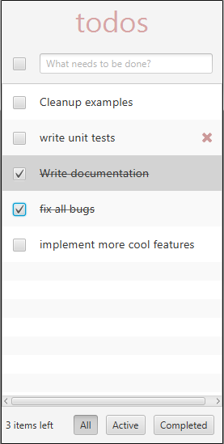

# MvvmFX TodoMVC Example

This example is influenced by the popular [TodoMVC.com](http://todomvc.com/) example. 
*TodoMVC* is a project that is used to compare different JavaScript/HTML5 libraries. 
All example apps on the website implement the same requirements. 
This makes comparing the different libraries and frameworks easier. 
While the original TodoMVC is targeted for JavaScript and web frameworks we have 
implemented a JavaFX variant using mvvmFX.

